# Tree Timer App

## Introduction

Tree Timer App is a flutter application, that can be used either for Android phones and IOS phones, which allows users to interact with an IoT equiptment.

The IoT equipment aims is to collect data from trees in order to study the quality of the wood.

## Features

- Account management to save projects
- More funcionalities in coming...

## Tech

Tree Timer App uses a variaty of technologies to provide the desired servies, such as:

- [Flutter] - Open source framework for multi-platform applications.
- [NodeJS]  - Open source cross-platform JavaScript runtime environment     used for server-side programming.
- [Express] - Fast node.js network app framework.
- [MongoDB] - Backend database used to store users data and projects.
- [Render]  - Cloud application hosting for Mongo database.

## Project Structure

This flutter project has serveral folders that contains the files that are necessary for the correct execution.

It is divided into two essential parts:

* Flutter code ([Click here](lib/README.md))
* NodeJS code ([Click here](server/README.md))

## Screens

#### Login screen

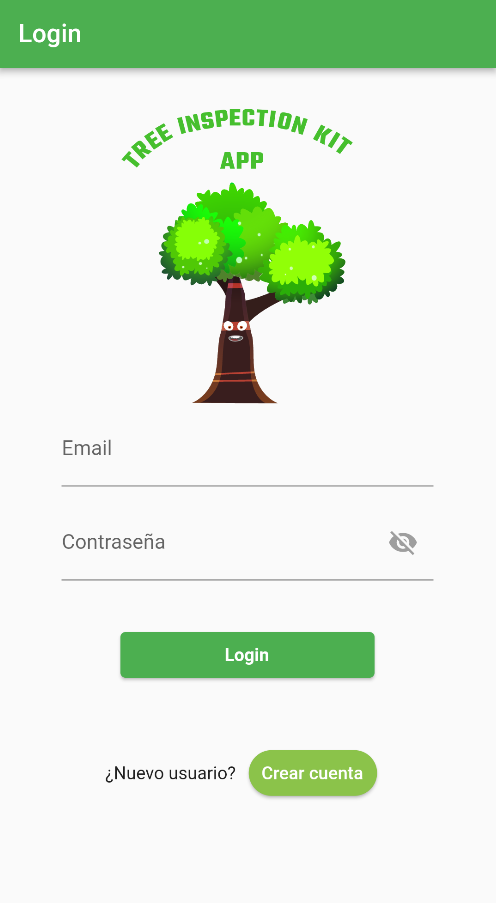

#### Register screen

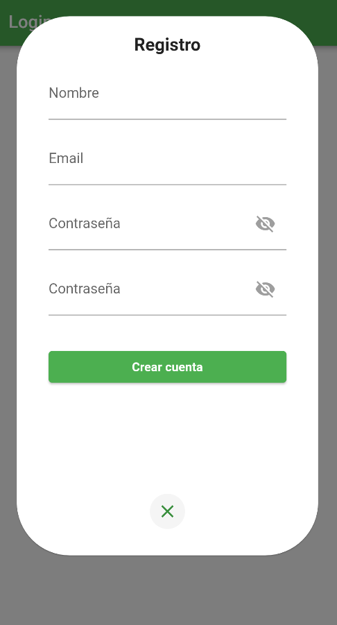

#### Home screen

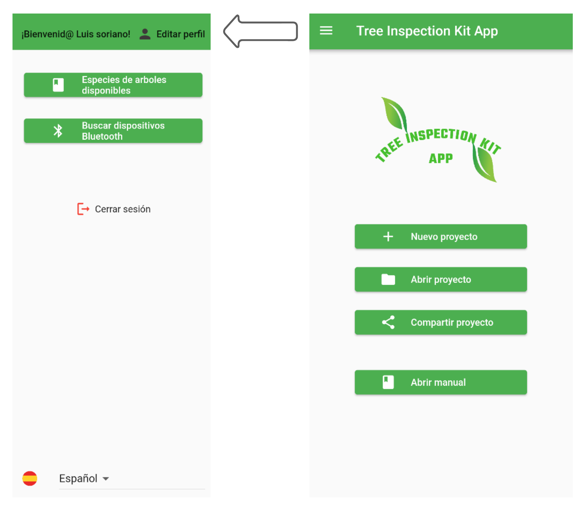

#### Profile form

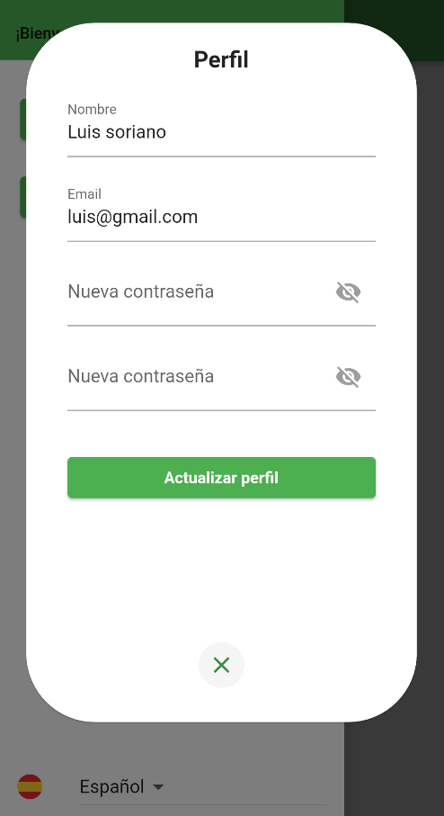

#### Bluetooth screen

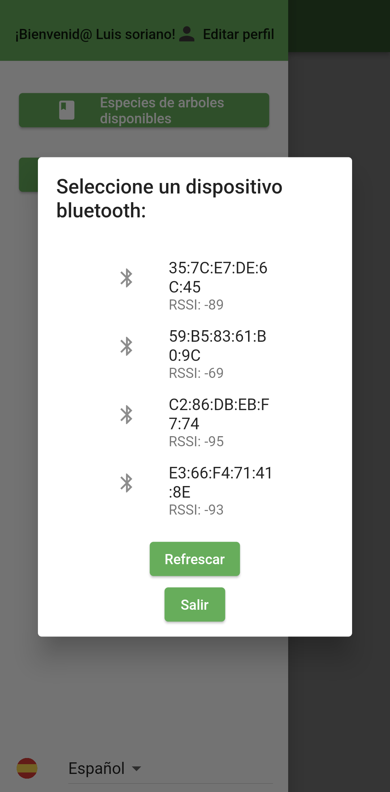

#### Handbook screen

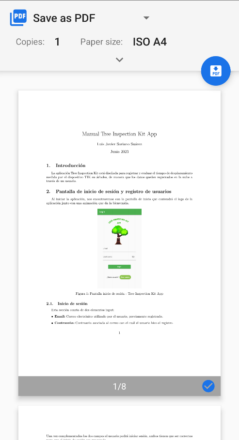

#### Proyect screens

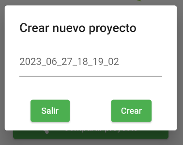
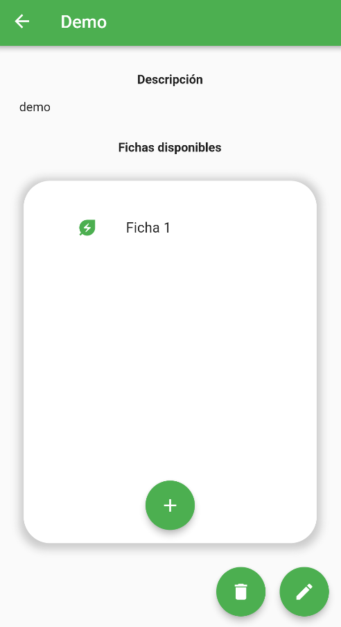

#### Data sheet screen

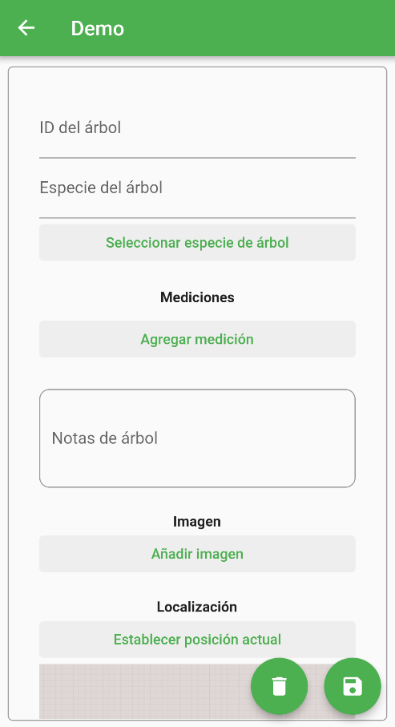
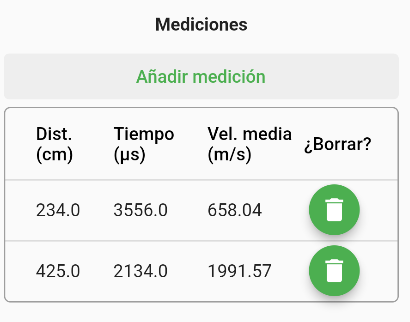
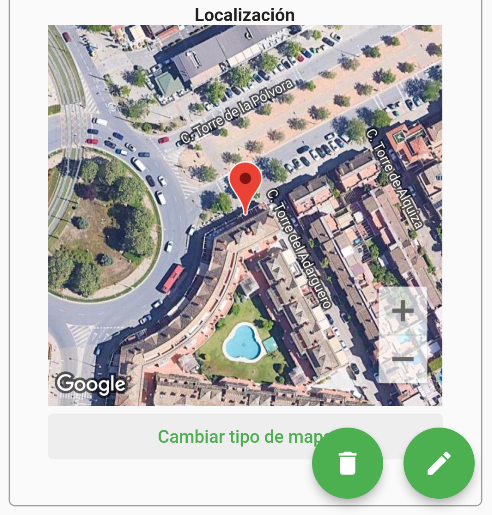

   [Flutter]: [https://flutter.dev](https://flutter.dev)
   [NodeJS]: [https://nodejs.org/en/](https://nodejs.org/en/)
   [Express]: [http://expressjs.com](http://expressjs.com)
   [MongoDB]: [https://www.mongodb.com](https://www.mongodb.com)
   [Render]: [https://render.com](https://render.com)

[//]: #
